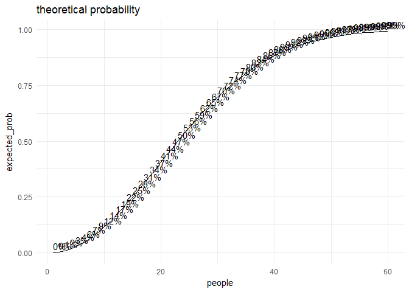
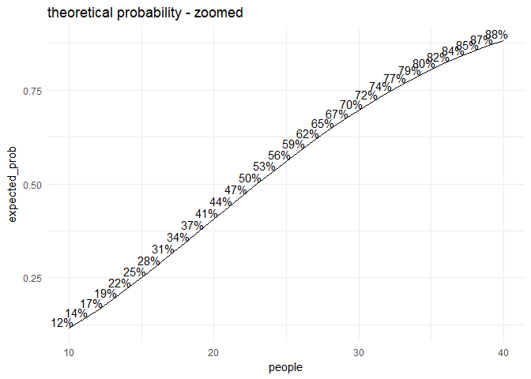
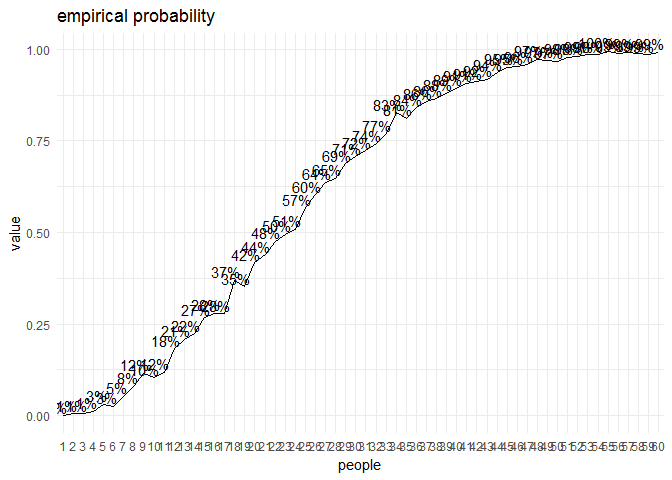
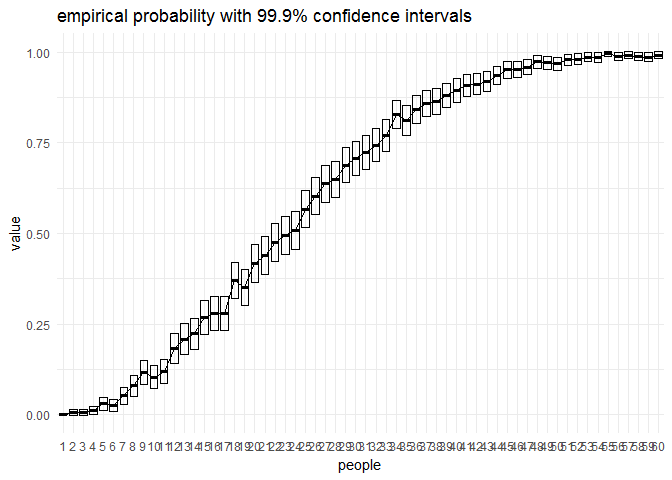

Birthday Paradox in R
================
Michał Wrąbel

Did you know that it takes only 24 people to be over 50% sure that there's a lucky pair who share the same day of birth? That's what birthday paradox is all about. The more counterintuitive it feels, the more astounding is the fact that actually it is easily provable.

Here I'd like to show you, my Dearest Reader, R implementation of birthday paradox. Enjoy!

Step 1: Prepare R environment
-----------------------------

``` r
# clean R workspace beforehand
rm(list = ls())

# load libraries
library(ggplot2)
library(reshape2)
library(Rmisc)
```

    ## Loading required package: lattice

    ## Loading required package: plyr

For the sake of simplicity, I'll introduce assumption that each year consists of 365 days. Secondly, I could safely assume that distribution of birthdays across all days is uniform (that's not true, but very close to true).

In fact those assumptions won't heavily influence final results. In additional read there's an article in which author lifts those two assumptions - I recommend it wholeheartedly for further read on the topic!

Step 2: Create dataframe
------------------------

``` r
# create empty dataframe
yr_days <- 365
df <- data.frame(people = rep(0, yr_days), expected_prob = rep(0, yr_days))

# compute probabilities
for(people in 1:yr_days) {
  n_pairs       <- choose(people, 2)
  expected_prob <- 1 - ((yr_days - 1)/yr_days)**n_pairs
  
  # save the result in a dataframe
  df[people, ]  <- c(people, expected_prob)
}

# first few probabilities (starting from 1 person in a room with probability equal 0.00)
head(df)
```

    ##   people expected_prob
    ## 1      1   0.000000000
    ## 2      2   0.002739726
    ## 3      3   0.008196680
    ## 4      4   0.016326175
    ## 5      5   0.027061942
    ## 6      6   0.040317031

Step 3: Visualize!
------------------

``` r
# visualisation
ggplot(df[1:60, ], aes(x = people, y = expected_prob)) +
  geom_line() +
  geom_text(aes(label = sprintf("%1.0f%%", expected_prob*100)),
            vjust = -0.4,
            hjust = 0) +
  labs(title = "theoretical probability", x = "people") +
  theme_minimal()
```



``` r
# zoomed version of plot above
ggplot(df[10:40, ], aes(x = people, y = expected_prob)) +
  geom_line() +
  geom_text(aes(label = sprintf("%1.0f%%", expected_prob*100)),
            vjust = -0.2,
            hjust = 0.8) +
  labs(title = "theoretical probability - zoomed", x = "people") +
  theme_minimal()
```



Paradox decomposed does not seem so paradoxical, doesn't it?

However, what would have become of statistics if it were lacking confidence intervals? I would not dare to answer this question hence I decided to include also a tiny simulation.

Is the paradox visible only in 'means' and 'aggregated estimations'? Or maybe it is observable roughly every time with similar probabilities? The simulation will help in finding an answer.

Step 4: Simulation
------------------

``` r
# simple simulation
p <- data.frame()
i_max <- 1000
j_max <- 60

for (j in 1:j_max) {
  
  for (i in 1:i_max) {
    
    v <- floor(runif(j, min = 1, max = yr_days + 1))
    p[i, j] <- ifelse(length(v) - length(unique(v)) > 0, 1, 0)
    
  }
  
}
sapply(p, mean)
```

    ##    V1    V2    V3    V4    V5    V6    V7    V8    V9   V10   V11   V12 
    ## 0.000 0.003 0.010 0.019 0.021 0.035 0.052 0.087 0.116 0.132 0.132 0.178 
    ##   V13   V14   V15   V16   V17   V18   V19   V20   V21   V22   V23   V24 
    ## 0.176 0.208 0.229 0.295 0.321 0.340 0.377 0.397 0.453 0.503 0.503 0.552 
    ##   V25   V26   V27   V28   V29   V30   V31   V32   V33   V34   V35   V36 
    ## 0.576 0.614 0.649 0.665 0.687 0.697 0.728 0.751 0.789 0.819 0.817 0.844 
    ##   V37   V38   V39   V40   V41   V42   V43   V44   V45   V46   V47   V48 
    ## 0.858 0.880 0.895 0.867 0.915 0.906 0.933 0.942 0.944 0.942 0.958 0.961 
    ##   V49   V50   V51   V52   V53   V54   V55   V56   V57   V58   V59   V60 
    ## 0.958 0.975 0.981 0.984 0.983 0.981 0.990 0.990 0.992 0.989 0.993 0.998

So far so good. Simulated means are very similar to theoretical values. But what about forementioned confidence intervals?

``` r
# simulation - summary
colnames(p) <- 1:60
ci = 0.999
p_summary <- summarySE(melt(p), measurevar = "value", groupvars = c("variable"), conf.interval = ci)
```

    ## No id variables; using all as measure variables

``` r
ggplot(p_summary, aes(x = variable, y = value)) +
  geom_line(group = 1) +
  geom_text(aes(label = sprintf("%1.0f%%", value * 100)),
            vjust = -0.2,
            hjust = 0.8) +
  labs(title = "empirical probability", x = "people") +
  theme_minimal()
```



``` r
# zoomed version of plot above
ggplot(p_summary, aes(x = variable, y = value)) +
  geom_crossbar(aes(ymin = value - ci, ymax = value + ci), width = 0.75, fatten = 2.5) +
  geom_line(group = 1) +
  labs(title = paste0("empirical probability with ", sprintf("%1.1f%%", ci * 100), " confidence intervals"), x = "people") +
  theme_minimal()
```



The interpretation in straightforward. For example, in case of 12 people in the same room, there is 17.3% (+/- 3.9%) chance that there is a lucky pair of people sharing the same day of birth. That's pretty stable, even for a paradox.

Additional resources
--------------------

-   <http://www.panix.com/~murphy/bday.html>
-   <https://betterexplained.com/articles/understanding-the-birthday-paradox/>
-   <http://blog.revolutionanalytics.com/2012/06/simulating-the-birthday-problem-with-data-derived-probabilities.html>
